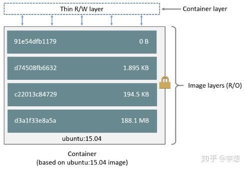

# 虚拟化和容器化区别
>   - 虚拟化：每个虚拟环境都有操作系统，有资源隔离
>   - 容器化：每个容器环境只有运行工具，无资源隔离

# 安装教程
>   1. yum install -y yum-utils device-mapper-persistent-data lvm2  
>       **device-mapper-persistent-data lvm2 数据存储驱动，用于docker的数据存储**
>   2. yum-config-manager --add-repo http://mirrors.aliyun.com/docker-ce/linux/centos/docker-ce.repo  
>       **添加yum源**
>   3. yum makecache fast  
>       **检测yum源速度，centos8 去掉fast**
>   4. yum -y install docker-ce  
>       **安装社区版docker，centos8 加上--nobest**
>   5. service docker start  
>       **启动docker服务**
>   6. 阿里云加速服务，加快镜像下载速度

# 使用教程
>  - docker pull hello-world  
>       **下载镜像**
>  - docker run hello-workd  
>       **创建容器并运行**

# 基本概念
>   - docker是提供应用打包，部署与运行应用的容器化平台
>       ```
>           应用程序
>           docker engine（docker引擎）
>           可用资源（物理机/虚拟机）
>       ```
>   - docker engine,C/S架构，http协议
>       ```
>           docker CLI(client)
>           REST API
>           docker daemon(server)
>       ```
>   - container、image、register

# docker常用命令
>   - docker pull [镜像名]<:tag> **从远程仓库抽取镜像，不加tags默认下载最新版本，[docker镜像官方地址](hub.docker.com)**
>   - docker images **查看本地镜像**
>   - docker run [镜像名]<:tag> **创建容器，启动容器**
>       - -p [宿主机端口]:[容器端口] 端口映射
>       - -d 后台运行
>       - -v [宿主机路径]:[容器内挂载路径] 挂载目录
>       - --name [容器名称] **定义容器名称**
>       - --link [容器名称] **关联其他容器，后面可直接通过该容器名称直接访问**
>   - docker ps **查看正在运行中的容器**
>       - -a 显示全部
>   - docker create [镜像名]<:tag> **创建容器**
>   - docker start [容器id] **启动容器**
>   - docker restart [容器id] **重启容器**
>   - docker stop [容器id] **停止容器，先发SIGTERM，在规定时间内还未结束再发SIGKILL**
>   - docker kill [容器id] **杀死容器，直接发起SIGKILL**
>   - docker pause [容器id] **暂停容器，资源临时挂起**
>   - docker unpause [容器id] **恢复容器**
>   - docker rm <-f> [容器id] **删除容器**
>   - docker rmi <-f> [镜像名]<:tags> **删除镜像**
>   - docker exec [容器id] [命令]
>       - -it 采用交互方式执行命令
>       - PS：进入容器后，可通过exit命令退出容器。当失败时，可先通过ctrl+c，再执行exit
>   - docker build [dockerfile目录]
>       - t [镜像名]<:tag> 定义镜像名
>   - docker cp [容器id]:[容器内文件名] [宿主机文件名]
>   - docker inspect [容器id] **显示容器信息**
>   - docker network [option] **docker网络服务**
>
>   PS
>   - 当容器遇到异常（例如：oom）会进入停止状态，根据策略来决定是否需要重新启动容器
>   - 某些容器启动后会自动退出，可通过加上-it /bin/bash 保持运行
>   - ctrl + p + q 仅退出容器，不关闭

# dockerfile镜像描述文件
>   ```
>       FROM [基准镜像]
>       MAINTAINER [维护人/组织]
>       WORKDIR [工作目录]
>       ADD [源文件] [镜像目标目录]
>       ADD [目录（目录里的内容，不包含目录）] [镜像目标目录]
>       
>   ```

# 镜像分层
> ```
>    Step 1/4 : FROM tomcat
>     ---> 040bdb29ab37
>    Step 2/4 : MAINTAINER gjm
>     ---> Using cache
>     ---> acdaeb797865
>    Step 3/4 : WORKDIR /usr/local/tomcat/webapps
>     ---> Using cache
>     ---> 99e7be3eb1b6
>    Step 4/4 : ADD docker1 ./docker1
>     ---> 9720a901bc2e
>    Successfully built 9720a901bc2e
> ```
>   
> 在构建docker镜像时，可看到每执行一步命令都会有一个id，这个id是docker的临时镜像id。    
> 这个临时镜像只会用于镜像的构建，而不能用于启动或其他功能。  
> 每个id都为一个临时镜像，所以每步命令都会生成一个临时镜像（只读层），不过当有相同的命令时，会using cache。  
> 每层只记录本层所做的更改，而这些层都是只读层。当你启动一个容器，Docker会在最顶部添加读写层，你在容器内做的所有更改，如写日志、修改、删除文件等，都保存到了读写层内，一般称该层为容器层。    
> 所有对容器的修改都发生在此层，镜像并不会被修改，也即前面说的 COW(copy-on-write)技术。容器需要读取某个文件时，从上到下找，而如果需要修改某文件，则将该文件拷贝到顶部读写层进行修改，只读层保持不变。
> 所以当有某个镜像被引用创建容器时，这个镜像一般来说不能被删除。

# dockerfile基础命令
> - FROM [镜像名] 基于基准镜像 **必须为第一个命令**
>   - FROM scratch 不依赖任何基准镜像
> - MAINTAINER [个人/组织] 说明信息（维护人/维护组织）
> - LABEL [key]=[value] [key]=[value]
> - WORKDIR [工作目录] 设置工作目录 **1、功能类型cd命令，2、当目录不存在时，会自动创建**
> - COPY [源文件] [目标目录] 复制文件
> - ADD [源文件] [目标目录] **1、支持源文件的解压，2、支持远程文件，但不支持远程文件解压**
> - ENV [key]=[value] [key]=[value] 设置环境变量
> - ARG [key]=[value] 镜像构建时环境变量
> - VOLUME ["容器挂载路径", "容器挂载路径"] **无法直接指定宿主机上具体目录，自动在宿主机上生成目录（很鸡肋。）**
> - EXPOSE [端口/协议] 暴露接口
>   ```
>       ENV JAVA_HOME /usr/local/openjdk8
>       RUN ${JAVA_HOME}/bin/java -jar test.jar
>   ```
> PS:需要使用空格时，可通过\来进行转义

# dockerfile执行命令
> - RUN 
>   - 镜像构建执行命令 
>   - docker build阶段
> - CMD 
>   - 容器启动时执行命令 
>   - docker run阶段
>   - PS:
>       - 当有多条命令时，只会执行最后的命令
>       - 如果容器启动时附加命令，则CMD不执行
>       - 当配置了ENTRYPOINT时，该命令作为参数
> - ENTRYPOINT 
>   - 容器启动后执行命令 
>   - docker run阶段
>   - PS:
>       - 当有多条命令时，只会执行最后的命令
> PS: 可通过&&连接命令减少镜像层数
> ```
>   #shell命令格式[使用子进程]
>   [RUN/CMD/ENTRYPOINT] yum install -y vim
>     
>   #exec命令格式[替换当前进程，推荐]
>   [RUN/CMD/ENTRYPOINT] ["yum","install","-y", "vim"] 
> 
>   FROM centos
>   RUN ["echo","build image"]
>   CMD ["run container"]
>   ENTRYPOINT ["echo"]
> 
> ```

#  docker容器间通信
> - 单向通信
>   - docker虚拟ip
>       - 通过```docker inspect [通信目标dockerId]```命令，可获取docker间虚拟ip
>   - docker名
>       - 通过```docker run --link [通信目标docker名称]```命令，配置可直接访问docker名
> - 双向通信
>   - 网桥（建立了一个虚拟网卡）
>       - docker network ls 查看docker网络服务
>       - docker network create -d [网络类型] [网桥名称] 创建网桥
>       - docker network connect [网桥名称] [容器名称] 容器绑定网桥

# docker容器间共享数据
> - run -v参数
>    ```
>       docker run -v [宿主机路径]:[容器内挂载路径]
>    ```
> - run --volumes-from参数（推荐方案）
>   - 创建共享容器
>       ```
>           docker create --name [共享容器名] -v [宿主机路径]:[容器内挂载路径]
>       ```
>   - 共享容器挂载点（复制共享容器的挂载信息）
>       ```
>           docker run --volumes-from [共享容器名]
>       ```

# docker compose（容器编排工具）
> - 单机多容器（不能部署集群）
> - 通过yml文件定义