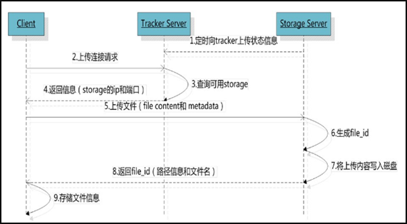
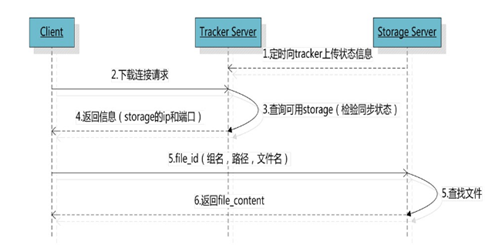

# FastDFS
> FastDFS 是一个开源的高性能分布式文件系统（DFS）。 它的主要功能包括：文件存储，文件同步和文件访问，以及高容量和负载平衡。主要解决了海量数据存储问题，特别适合以中小文件（建议范围：4KB < file_size <500MB）为载体的在线服务。  
> FastDFS 系统有三个角色：跟踪服务器(Tracker Server)、存储服务器(Storage Server)和客户端(Client)。
>   - Tracker Server：跟踪服务器，主要做调度工作，起到均衡的作用；负责管理所有的 storage server和 group，每个 storage 在启动后会连接 Tracker，告知自己所属 group 等信息，并保持周期性心跳。
>   - Storage Server：存储服务器，主要提供容量和备份服务；以 group 为单位，每个 group 内可以有多台 storage server，数据互为备份。
>   - Client：客户端，上传下载数据的服务器，也就是我们自己的项目所部署在的服务器。
>   
>
> ## FastDFS的存储策略
> - 为了支持大容量，存储节点（服务器）采用了分卷（或分组）的组织方式。存储系统由一个或多个卷组成，卷与卷之间的文件是相互独立的，所有卷的文件容量累加就是整个存储系统中的文件容量。一个卷可以由一台或多台存储服务器组成，一个卷下的存储服务器中的文件都是相同的，卷中的多台存储服务器起到了冗余备份和负载均衡的作用。  
> - 在卷中增加服务器时，同步已有的文件由系统自动完成，同步完成后，系统自动将新增服务器切换到线上提供服务。当存储空间不足或即将耗尽时，可以动态添加卷。只需要增加一台或多台服务器，并将它们配置为一个新的卷，这样就扩大了存储系统的容量。
>
> ## FastDFS的上传过程
> Storage Server会定期的向Tracker Server发送自己的存储信息。当Tracker Server Cluster中的Tracker Server不止一个时，各个Tracker之间的关系是对等的，所以客户端上传时可以选择任意一个Tracker。  
> 当Tracker收到客户端上传文件的请求时，会为该文件分配一个可以存储文件的group，当选定了group后就要决定给客户端分配group中的哪一个storage server。当分配好storage server后，客户端向storage发送写文件请求，storage将会为文件分配一个数据存储目录。然后为文件分配一个fileid，最后根据以上的信息生成文件名存储文件。  
> 
> - fileId = storage server ip + 文件创建时间 + 文件大小 + 文件crc32 + 一个随机数
>
> ## FastDFS的文件同步
> 写文件时，客户端将文件写至group内一个storage server即认为写文件成功，storage server写完文件后，会由后台线程将文件同步至同group内其他的storage server。  
> 每个storage写文件后，同时会写一份binlog，binlog里不包含文件数据，只包含文件名等元信息，这份binlog用于后台同步，storage会记录向group内其他storage同步的进度，以便重启后能接上次的进度继续同步；进度以时间戳的方式进行记录，所以最好能保证集群内所有server的时钟保持同步。  
> storage的同步进度会作为元数据的一部分汇报到tracker上，tracker在选择读storage的时候会以同步进度作为参考。
> - 同group内，由源节点向其他节点同步
>
> ## FastDFS的文件下载
> 跟upload file一样，在downloadfile时客户端可以选择任意tracker server。tracker发送download请求给某个tracker，必须带上文件名信息，tracke从文件名中解析出文件的group、大小、创建时间等信息，然后为该请求选择一个storage用来服务读请求。
> 

# FastDFS安装  [wiki](https://github.com/happyfish100/fastdfs/wiki)
> ## 使用的系统软件
> | 名称 | 说明 |
> | --- | --- |
> | centos | 7.x |
> | libfastcommon | FastDFS分离出的一些公用函数包 |
> | FastDFS | FastDFS本体 |
> | fastdfs-nginx-module | FastDFS和nginx的关联模块 |
> | nginx | nginx1.15.4 |
> 
> ## 编译环境
> - Centos ```yum install git gcc gcc-c++ make automake autoconf libtool pcre pcre-devel zlib zlib-devel openssl-devel wget vim -y```
> - Debian ```apt-get -y install git gcc g++ make automake autoconf libtool pcre2-utils libpcre2-dev zlib1g zlib1g-dev openssl libssh-dev wget vim```
>
> ## 磁盘目录
> | 说明 | 位置 |
> | --- | --- |
> | 所有安装包 | /usr/local/src |
> | 数据存储位置 | /home/fastdfs |
> | 配置路径 | /etc/fdfs |
> ```
>   mkdir /home/fastdfs  #创建数据存储目录
>   cd /usr/loacl/src  #切换到安装目录准备下载安装包
> ```
> 
> ## 安装libfastcommon
> ```
>   git clone https://github.com/happyfish100/libfastcommon.git --depth 1
>   cd libfastcommon/
>   ./make.sh && ./make.sh install #编译安装
> ``` 
>
> ## 安装FastDFS
> ```
>   cd ../ #返回上一级目录
>   git clone https://github.com/happyfish100/fastdfs.git --depth 1
>   cd fastdfs/
>   ./make.sh && ./make.sh install #编译安装
>   #配置文件准备
>   cp /etc/fdfs/tracker.conf.sample /etc/fdfs/tracker.conf
>   cp /etc/fdfs/storage.conf.sample /etc/fdfs/storage.conf
>   cp /etc/fdfs/client.conf.sample /etc/fdfs/client.conf #客户端文件，测试用
>   cp /usr/local/src/fastdfs/conf/http.conf /etc/fdfs/ #供nginx访问使用
>   cp /usr/local/src/fastdfs/conf/mime.types /etc/fdfs/ #供nginx访问使用
> ```
> 
> ## 安装fastdfs-nginx-module
> ```
>   cd ../ #返回上一级目录
>   git clone https://github.com/happyfish100/fastdfs-nginx-module.git --depth 1
>   cp /usr/local/src/fastdfs-nginx-module/src/mod_fastdfs.conf /etc/fdfs
> ```
>
> ## 安装nginx
> ```
>   wget http://nginx.org/download/nginx-1.18.0.tar.gz #下载nginx压缩包
>   tar -zxvf nginx-1.18.0.tar.gz #解压
>   cd nginx-1.18.0/
>   #添加fastdfs-nginx-module模块
>   ./configure --add-module=/usr/local/src/fastdfs-nginx-module/src/ 
>   make && make install #编译安装
> ```


# 单机部署
> ## tracker配置
> ```
>   vi /etc/fdfs/tracker.conf
>       port=22122  #tracker服务器端口（默认22122，一般不修改）
>       base_path=/home/fastdfs/tracker  #存储日志和数据的根目录
> ```
> 
> ## storage配置
> ```
>   vi /etc/fdfs/storage.conf
>       port=23000  #storage服务端口（默认23000，一般不修改）
>       base_path=/home/fastdfs/storage/base  #数据和日志文件存储根目录
>       store_path0=/home/fastdfs/storage/data  #第一个存储目录
>       tracker_server=[trackerServerIP]:[trackerServerPort]  #tracker服务器IP和端口
>       http.server_port=8888  #http访问文件的端口（默认8888，看情况修改，和nginx中保护一致）
> ```
> 
> ## client测试
> ```
>   vi /etc/fdfs/client.conf
>       base_path=/home/fastdfs/client
>       tracker_server=[trackerServerIP]:[trackerServerPort]  #tracker服务器IP和端口
>   
>   fdfs_upload_file [clientConfigPath] [filePath]  #保存后测试，返回fileId表示成功。
> ```
> 返回的文件id由group（卷/分组）、存储目录（store_path[number]存储路径）、两级子目录、文件名（具有一定信息）、文件后缀名拼接而成
> group1/M00/00/00/sdfawfgafdgweqgawefawef.txt  
> 
> ## 配置nginx访问
> ```
>   vi /etc/fdfs/mod_fastdfs.conf
>       tracker_server=[trackerServerIP]:[trackerServerPort]  #tracker服务器IP和端口
>       url_have_group_name=true
>       store_path0=/home/fastdfs/storage/data
>   
>   vi  /usr/local/nginx/conf/nginx.conf
>       server {
>           listen 8888;  #该端口为storage.conf中http.server_port相同
>           server_name local;
>           location ~/group[0-9]/ {
>               ngx_fastdfs_module;
>           }
>           error_page 500 502 503 504 /50x.html
>           location = /50x.html {
>               root html;
>           }
>       }
> ```
> http://[ip]:[port]/[fileId]  #测试下载，用外部浏览器访问已上传过的文件

# 分布式部署
> ## tracker配置（跟单机差不多）
> ```
>   vi /etc/fdfs/tracker.conf
>       port=22122
>       base_path=/home/fastdfs/tracker
> ```
> 
> ## storage配置（跟单机差不多，就tracker_server参数配置多个）
> ```
>   vi /etc/fdfs/storage.conf
>       port=23000
>       base_path=/home/fastdfs/storage/base
>       store_path0=/home/fastdfs/storage/data
>       tracker_server=[trackerServerIP]:[trackerServerPort]  #tracker服务器IP和端口
>       tracker_server=[trackerServerIP]:[trackerServerPort]  #tracker服务器IP和端口
>       tracker_server=[trackerServerIP]:[trackerServerPort]  #tracker服务器IP和端口
>       http.server_port=8888  #http访问文件的端口（默认8888，看情况修改，和nginx中保护一致）
> ```
>
> ## client测试（跟单机差不多，就tracker_server参数配置多个）
> ```
>   vi /etc/fdfs/client.conf
>       base_path=/home/fastdfs/client
>       tracker_server=[trackerServerIP]:[trackerServerPort]  #tracker服务器IP和端口
>       tracker_server=[trackerServerIP]:[trackerServerPort]  #tracker服务器IP和端口
>       tracker_server=[trackerServerIP]:[trackerServerPort]  #tracker服务器IP和端口
>   
>   fdfs_upload_file [clientConfigPath] [filePath]  #保存后测试，返回fileId表示成功。
> ```
> 
> ## 配置nginx访问
> ```
>   vi /etc/fdfs/mod_fastdfs.conf
>       tracker_server=[trackerServerIP]:[trackerServerPort]  #tracker服务器IP和端口
>       tracker_server=[trackerServerIP]:[trackerServerPort]  #tracker服务器IP和端口
>       tracker_server=[trackerServerIP]:[trackerServerPort]  #tracker服务器IP和端口
>       url_have_group_name=true
>       store_path0=/home/fastdfs/storage/data
>   vi /usr/local/nginx/conf/nginx.conf
>       server {
>           listen 8888;
>           server_name localhost;
>           location ~/group[0-9]/ {
>               ngx_fastdfs_module;
>           }
>           error_page 500 502 503 504 /50x.html;
>           location = /50x.html {
>               root html;  
>           }
>       }
> ```

# 启动
> ## 防火墙
> ```
>   systemctl stop firewalld.service  #关闭防火墙
>   systemctl restart firewalld.service  #重启防火墙
> ```
> 
> ## tracker
> ```
>   /usr/bin/fdfs_trackerd [trackerConfigPath] start  #启动tracker服务
>   /usr/bin/fdfs_trackerd [trackerConfigPath] restart  #重启tracker服务
>   /usr/bin/fdfs_trackerdd stop #停止tracker服务
>   chkconfig fdfs_trackerd on #自启动tracker服务
> ```
> 
> ## storage
> ```
>   /usr/bin/fdfs_storaged [storageConfigPath] start  #启动storage服务
>   /usr/bin/fdfs_storaged [storageConfigPath] restart  #重动storage服务
>   /usr/bin/fdfs_storaged stop  #停止动storage服务
>   chkconfig fdfs_storaged on  #自启动storage服务
> ```
>
> ## nginx
> ```
>   /usr/local/nginx/sbin/nginx  #启动nginx
>   /usr/local/nginx/sbin/nginx -s reload  #重启nginx
>   /usr/local/nginx/sbin/nginx -s stop  #停止nginx
> ```
> 
> ## 检测集群
> ```
>   /usr/bin/fdfs_monitor /etc/fdfs/storage.conf  #会显示会有几台服务器，有三台就会显示Storage 1-Storage 3 的详细信息
> ```

# 权限控制
> FastDFS的权限控制是在服务端开启token验证，客户端根据文件名、当前unix时间戳、秘钥获取token，在地址中带上token参数即可通过http方式访问文件。
> 1. 服务端开启token验证
>   ```
>       vi /etc/fdfs/http.conf
>           http.anti_steal.check_token=true  #开启token验证
>           http.anti_steal.token_ttl=[second]  #设置token失效时间
>           http.anti_steal.secret_key=[secert]  #密钥，跟客户端配置文件的fastdfs.http_secert_ley保持一致
>           http.anti_steal.token_check_fail=[filePath]  #token校验失败，返回页面
>   ```
> 2. 配置客户端
>   ```
>       vi /etc/fdfs/client.conf
>           fastdfs.http_anti_steal_token=true  #开启token验证
>           fastdfs.http_secret_key=[secert]  #密钥，跟服务器配置文件的http.anti_steal.secret_key保持一致
>   ```
> 3. 客户端生成token
>   访问文件需要带上生成的token以及unix时间戳，所以返回的token是token和时间戳的拼接  
>   ```
>       ts = Instant.now().getEpochSecond();
>       token = ProtoCommon.getToken(getFilename(filepath), ts, httpSecretKey);
>   ```
>   fileId?token=[token]&ts=[timestamp]
> 4. 注意问题
>   - 服务器时间是否一致

# 说明
> ## 配置文件
> tracker_server #有几台服务器写几个
> group_name #地址的名称的命名
> bind_addr #服务器ip绑定
> store_path_count #store_path(数字)有几个写几个
> store_path(数字) #设置几个储存地址写几个 从0开始
>
> ## 可能遇到的问题
> 如果不是root 用户 你必须在除了cd的命令之外 全部加sudo
> 如果不是root 用户 编译和安装分开进行 先编译再安装
> 如果上传成功 但是nginx报错404 先检查mod_fastdfs.conf文件中的store_path0是否一致
> 如果nginx无法访问 先检查防火墙 和 mod_fastdfs.conf文件tracker_server是否一致
> 如果不是在/usr/local/src文件夹下安装 可能会编译出错
> 如果 unknown directive "ngx_fastdfs_module" in /usr/local/nginx/conf/nginx.conf:151，可能是nginx一直是启动的，必须要重启nginx才可以，`nginx -s reload`无效。
> 可通过base_path配置的路径查看日志

# 遗留问题
> 1. 断点上传下载
> 2. 文件元数据（文件相关属性）
> 3. 业务权限控制
> 4. storage server 或者 tracker server 故障
> 5. nginx下载文件-文件名问题
>   - nginx添加配置
>       ```
>           vi /usr/local/nginx/conf/nginx.conf
>               location ~/group[0-9]/ {
>               add_header Content-Disposition "attachment;filename=$arg_attname";  #在fastDFS组件前添加
>               ngx_fastdfs_module;
>           }
>       ```
> 6. 大图小图
>
